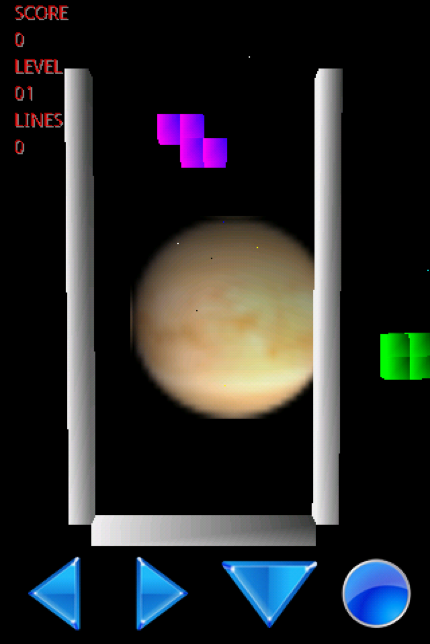

## Android_Tetris3D

This is my graduate project in 2010.
I was inspired by EA'Tetris game that I played on my phone, but it was in 2D only. So I decided to build an "clone" of it but in 3D using Java with Eclips IDE.

Here are some screenshots of this game:

